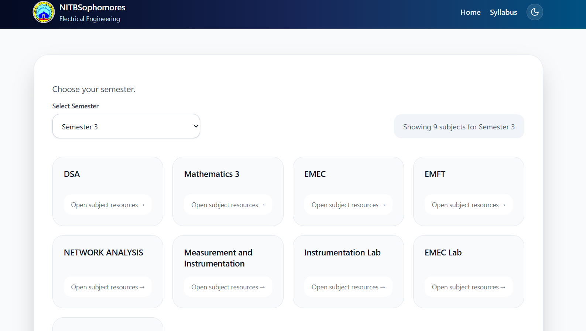
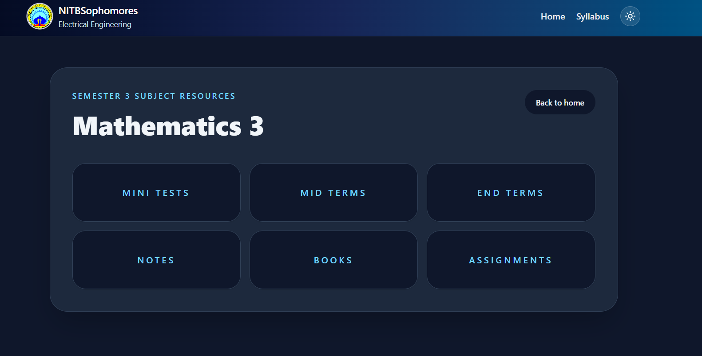
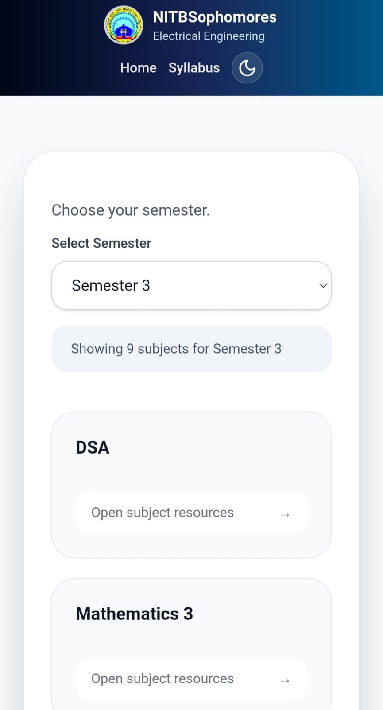

# 📚 NITBSophomores

NITBSophomores is a centralized platform built for **Electrical Engineering students of MANIT Bhopal** to access semester-wise study materials, previous year papers, notes, books, assignments, and lab manuals in one place.

🌐 **Live Website:** **https://nitbsophomores.netlify.app/**

---

## ✨ Features

- 📚 Semester-wise organization of study materials
- 📖 Subject-wise resource categorization
- 📝 Notes, Books & Previous Year Papers
- 📋 Assignments & Lab Manuals
- 🌙 Dark / Light Theme
- 📱 Fully Responsive Design
- ⚡ Fast and optimized with Vite

---

- ⚛️ React
- ⚡ Vite
- 🎨 Tailwind CSS
- 🧭 React Router DOM
- 💻 JavaScript (ES6+)

---

## 📸 Screenshots

### Home Page

### Subject Page

### Mobile View

---

## 👨‍💻 Author

**Karan Verma**

- GitHub: [karann6287-sudo](https://github.com/karann6287-sudo)
- LinkedIn: [Karan Verma](https://www.linkedin.com/in/karan-verma-48262a363/)

⭐ If you found this project useful, consider starring the repository!
